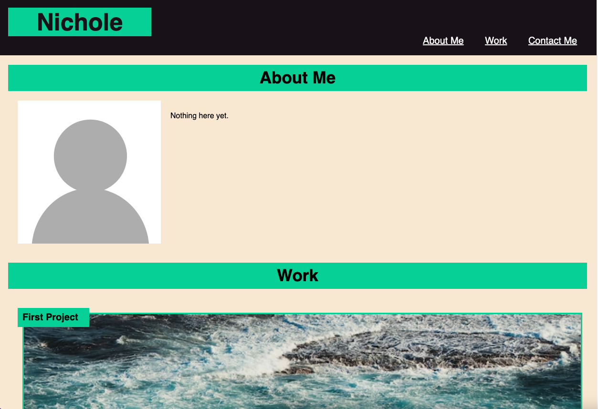

# Portfolio

## Site Picture

[Link to Deployed Website](https://ncguan.github.io/portfolio/)

## Technologies Used
- HTML
- CSS
- Git
- GitHub

## Summary
This project was built to create a portfolio of my work samples for employeers to review. The portfolio includes an About Me, Work, and Contact Me section that can be navigated to by the navigation links. Each application in the Work section have images that will take the viewer to the deployed application when clicked. The layout of the Work section adapts to the size of the viewport.

## Code Snippet
```css
/*main project size and takes up the entire width of page*/
.main-project{
    padding:20px;
    flex: 0 0 100%;
    height: 300px;
    width: 600px;
}

/*other project size and takes up 50% of width of page*/
.placeholder-project,
.sub-project,
.another-project{
    padding:20px;
    flex:0 0 50%;
    height: 150px;
    width: 300px;
}

```

## Author Links
[GitHub](https://github.com/ncguan)